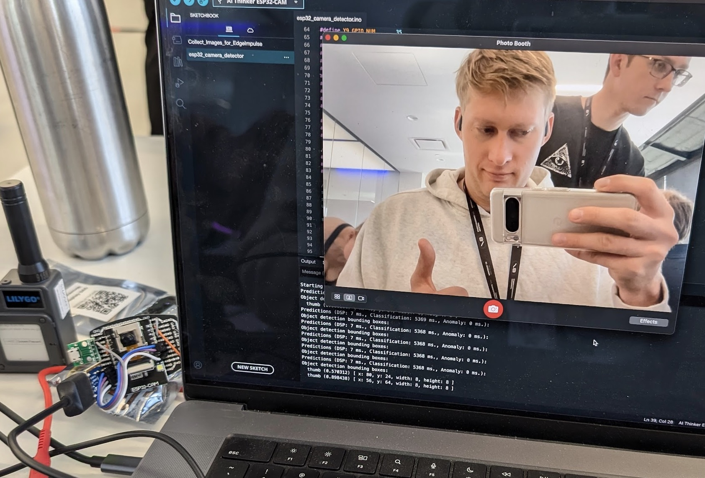
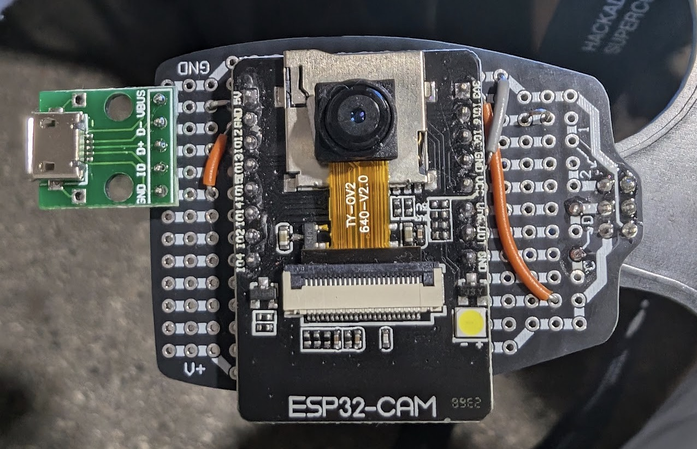
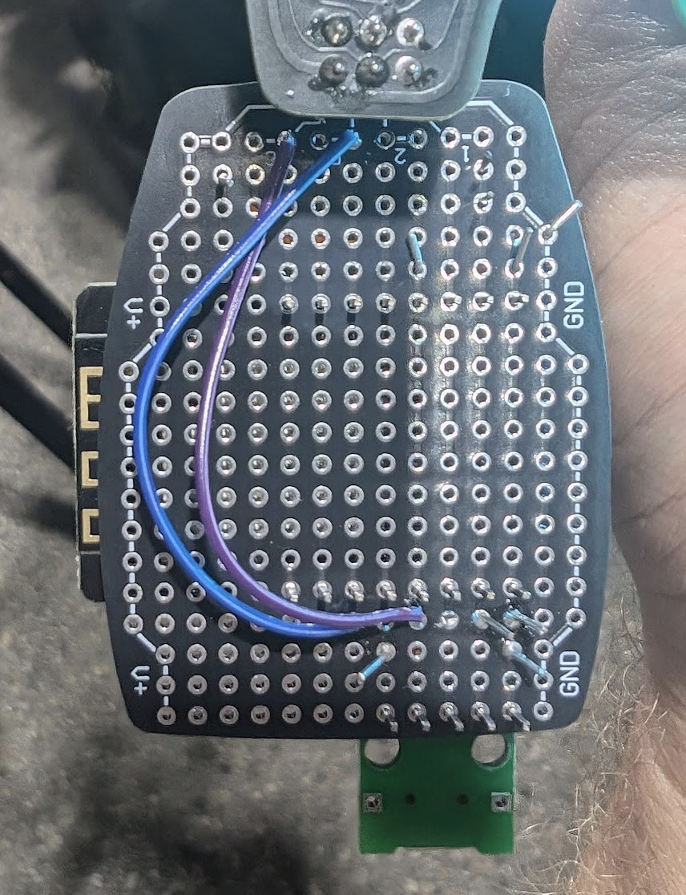
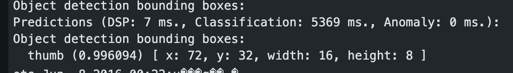
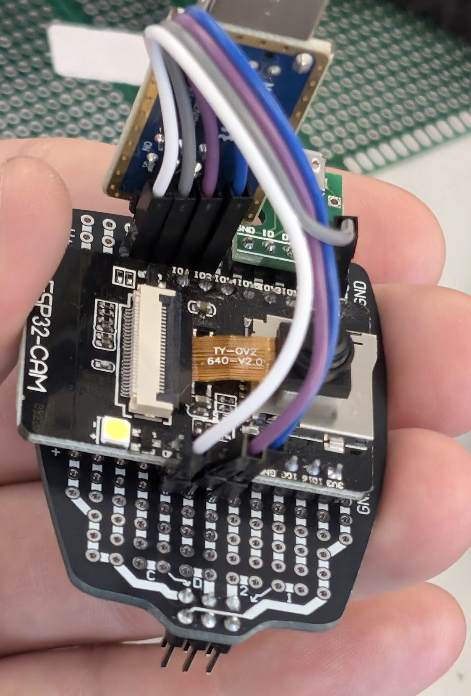

# esp32_cam_sao
SAO, now with AI!

## What is it?
This is a Supercon Add-On that I cobbled together with some wires and an ESP32-CAM board.

## The AI part

I followed a tutorial to train an AI model and program the inference side onto the ESP32.

Link: https://dronebotworkshop.com/esp32-object-detect/

The steps can be summarized as:
1. Program an image collection application onto the ESP32-CAM
2. Take a bunch of pictures with and without the object to be detected
3. Upload and classify the images by labeling the objects in the frame
4. Train the model, and export the example project
5. Modify the example project to add i2c capabilities, and program onto the ESP32

## The Hardware

I slotted the ESP32-CAM onto one of the protoboard SAOs provided with the Supercon 8 badge (without the CH chip).

The 3.3V rail on the ESP board was driven directly from the SAO 3.3V power, although that comes from a regulator on the badge's Pi Pico, which does not really have a lot of headroom on power. For that reason, I also often disconnected the 3.3V from the SAO input and powered the ESP32-CAM board from a microUSB header or the programmer.

I am using pin 14 and 13 on the ESP for the SDA and SCL, respectively. With the current implementation, however, the ESP32 bootloops when there is I2C traffic on the bus.

## The Software

The code that Edge Impulse exported as an Arduino library worked mostly out of the box, with the only change required being a constant in the ei_classifier_config.h file.

Also, there is some extra code thrown in to enable the I2C (Wire1) and flash the LED on GPIO 4 (which is very bright)

The code in the micropico folder can be used to potentially enable the I2C functionality, which in this case should light the slug SAO (from this repo: https://codeberg.org/ticktok/Satisfactory_Slug_SAO) a nice green, before fading back to red.

## Moar Pics

Here are a couple pics of the final form of the SAO after I gave up on I2C.

And here's an example of what the serial output looked like when it saw a thumb.

And finally, this is how I wired up the serial programmer (I jumped the GPIO0 to GND with a small wire.)

